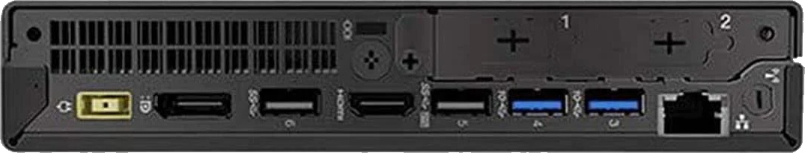

# srv-lo-2 - Local Server 2

=== "Front View"

    <figure markdown="span">
        { loading=lazy, width="500" }
        <figcaption></figcaption>
    </figure>

=== "Rear View"

    <figure markdown="span">
        { loading=lazy, width="500" }
        <figcaption></figcaption>
    </figure>