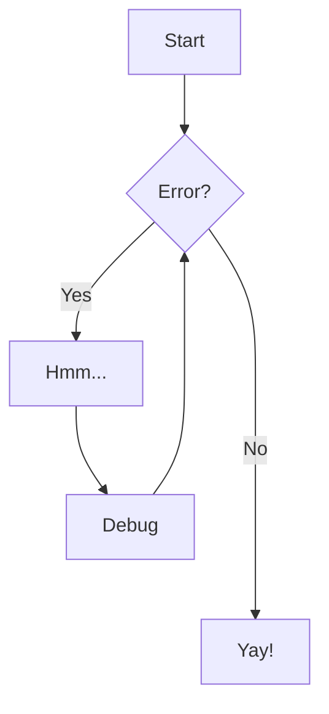

# Server Rack

=== "Front View"

    <figure markdown="span">
        { loading=lazy, width="500" }
        <figcaption></figcaption>
    </figure>

=== "Left View"

    <figure markdown="span">
        { loading=lazy, width="500" }
        <figcaption></figcaption>
    </figure>

=== "Rear View"

    <figure markdown="span">
        { loading=lazy, width="500" }
        <figcaption></figcaption>
    </figure>

=== "Right View"

    <figure markdown="span">
        { loading=lazy, width="500" }
        <figcaption></figcaption>
    </figure>

| Measurement    | Value |
|:--------------:|:-----:|
| Mounting Width | 10"   |
| U Count        | 26    |

